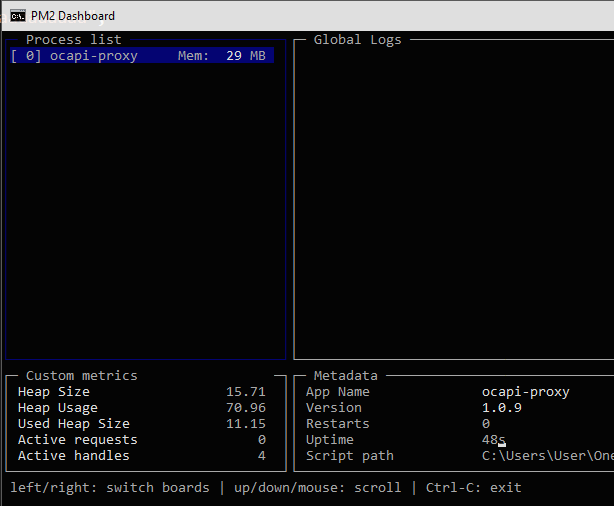
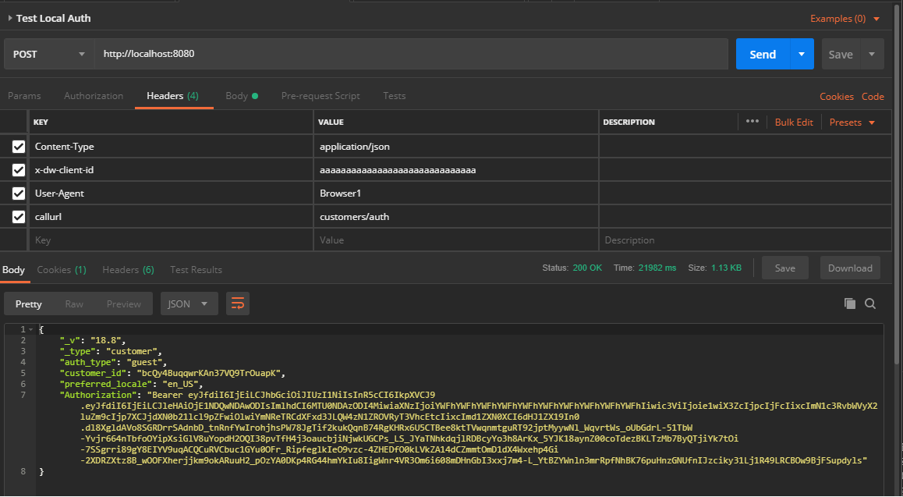

# Salesforce Commerce Cloud OCAPI Proxy 

  

[](https://nodei.co/npm/ocapi-proxy/)

This project will serve as a local NodeJS based Proxy server that will forward requests to an Salesforce Commerce Cloud OCAPI instance. 
This can be used for purposes such as testing 3rd party apps using OCAPI as well as integration for mobile/browser apps. 
The configuration of site_id, client_id are configured at the Proxy level rather than in the app directly. 

Coresponding Mobile App: {future link}

## Getting Started

Edit the config.json to match the server you are using. 
If you are using a service such as https://ngrok.com you may need to add the url to your Business Manager allowed origins.
**NOTE:** This package only forwards OCAPI requests from one point to another. The main purpose is for routing data around CORS and is typically useful for Mobile Applications. x-dw-client-id as a header attribute must be used instead of client_id as a url parameter.

## Prerequisites
```
Required:
    NodeJS
    Salesforce Commerce Cloud Sandbox - Configured for OCAPI

Optional:
    Postman or another rest API tool.
    ngrok - If you need to get a public url to your localhost
```
## Installing
```
npm install ocapi-proxy
```

## Running 

From the command line: 
```
npm start or node ocapi-proxy.js


```

Example:
```
npm start ocapi-proxy.js
```


You will need a config.json (one will be generated on first launch)
To edit the port, domain, etc.. modify the config.json file. 
server: your SalesForce Commerce Cloud server (currently all calls are https)
site_id: SFCC Site ID
version: SFCC OCAPI Version
port: Port that proxy listens for requests.

Example:
```
{
    "server": "yoursandbox.demandware.net",
    "site_id": "SiteGenesis",
    "version": "v20_3",
    "client_id": "aaaaaaaaaaaaaaaaaaaaaaaaaaaaaa",
    "port": 8080,
    "UA": "UA-XXXX-XXXX"  //This is optional can remove or leave blank.
};
```
## OCAPI Commands

You can send OCAPI commands to your local proxy. 
Specify the host to make the call.
Send the endpoint as the **callurl** header attribute.
All other attributes can be sent similar to a direct OCAPI call. 
This ensures that the Proxy communicates with OCAPI as middleware.

Example: 



## Deployment/Development

This is currently a work in progress. Please report any issues you find.
Latest: Fixes to logging added dates to log files.
Updated contact info for [Github](https://github.com/johnfacey) and [Twitter](https://twitter.com/johnfacey).

## OCAPI Output Modifications

Currently **Authorization** and **ETag**  headers are returned into the body from the output proxy rather than in the header. These are not needed in 19.X+

## Universal Analytics

Updated for: 

The Proxy will communicate with Google Universal Analytics if a "UA" attribute is found in the config file. You may leave this attribute blank or remove it from the config. Currently all UA requests are send as a event tag with the url of the Commerce Cloud Instance.

## Logging

The Proxy will generate logs where the current proxy has been executed in the logs directory.

## Built With

* [**NodeJS**](https://nodejs.org) 
* [**Express**](https://expressjs.com) - Minimalist Web Framework for NodeJS
* [**jsonfile**](https://www.npmjs.com/package/jsonfile) - read/write JSON files in NodeJS
* [**universal-analytics**](https://www.npmjs.com/package/universal-analytics) - Google Universal Analytics

## Authors

* **John Facey II** - *Initial work*  
[](https://github.com/johnfacey)
[](https://twitter.com/johnfacey)


## License

[](https://opensource.org/licenses/MIT)

See the [LICENSE.md](LICENSE.md) file for details

## Acknowledgments

* [**Salesforce Commerce Cloud**](https://www.salesforce.com/products/commerce-cloud/overview)
* [**NodeJS**](https://nodejs.org) 
* [**Visual Studio Code**](https://code.visualstudio.com)
* [**ngrok**](https://ngrok.com)